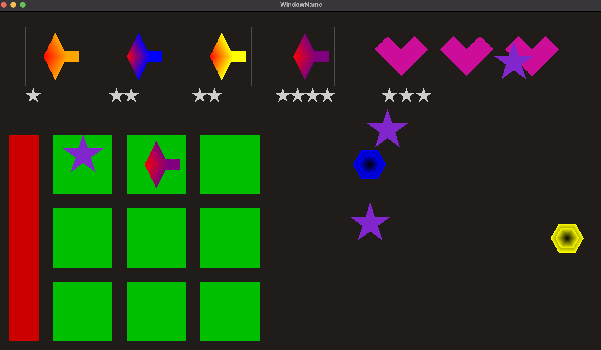

# Plants vs Zombies-Inspired Game

This project is a simple game inspired by Plants vs Zombies. Players must strategically place units on a grid to fend off incoming enemies. The gameplay involves colorful and animated visuals, as shown below. Drag n drop canons to destroy enemies that are the same color, also collect dropping stars to buy canons.



## How to Run

To run the game, execute the following command after building the project:

```bash
./bin/Debug/GFXFramework
```

## Additional Help
For more information on the platform and setup, refer to the [GFX Framework GitHub page](https://github.com/UPB-Graphics/gfx-framework).